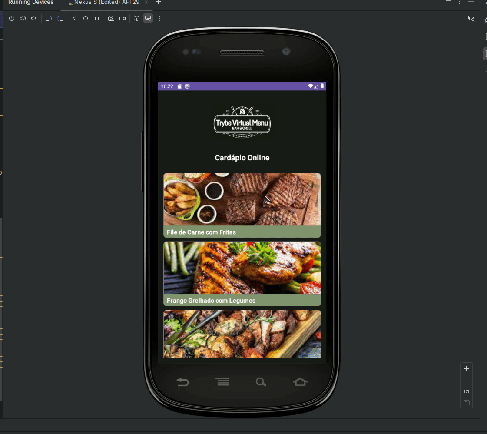

#  Restaurant Menu Application 


## 🌐 [](https://github.com/SamuelRocha91/kotlinVirtualMenu/blob/main/README.md) [](https://github.com/SamuelRocha91/kotlinVirtualMenu/blob/main/README_es.md) [](https://github.com/SamuelRocha91/kotlinVirtualMenu/blob/main/README_en.md) [](https://github.com/SamuelRocha91/kotlinVirtualMenu/blob/main/README_ru.md) [](https://github.com/SamuelRocha91/kotlinVirtualMenu) [](https://github.com/SamuelRocha91/kotlinVirtualMenu/blob/main/README_ar.md)


This repository contains the source code for an Android application that displays a restaurant menu. The application includes features to view a list of dishes, details for each dish, and navigation between screens.



## Features

1. **Menu Home Screen**:
   - Displays the restaurant's logo.
   - Home screen title.
   - List of menu items.

2. **Dish Details Screen**:
   - Displays the restaurant's logo.
   - Details screen title.
   - Back button.
   - Dish image.
   - Dish title.
   - Dish description.
   - Dish price.

3. **Available Dishes List**:
   - Includes dishes like Steak with Fries, Grilled Chicken with Vegetables, Mixed Grill of Steak and Chicken, among others.
   - Each dish includes an image, description, and price.

4. **Menu Item Layout**:
   - Uses `MaterialCardView` to display each menu item with an image and title.

5. **Click Events**:
   - Navigation to the details screen when clicking on a menu item.
   - Return to the main screen when clicking the back button on the details screen.

## Technologies Used

- **Android SDK**: For developing the Android application.
- **RecyclerView**: For displaying the list of menu items.
- **Data Classes**: For representing dish data.
- **Adapters**: For binding data to the user interface.
- **Layouts**: Includes `LinearLayout`, `ScrollView`, and `MaterialCardView` for structuring screens.

## Project Setup

To run the project locally, follow these steps:

### Prerequisites

- [Android Studio](https://developer.android.com/studio) installed on your machine.
- [JDK 11](https://www.oracle.com/java/technologies/javase-jdk11-downloads.html) or higher.

### Cloning the Repository

1. Clone the repository to your local machine:
   ```bash
   git clone git@github.com:SamuelRocha91/kotlinVirtualMenu.git
   ```

2. Navigate to the project directory:
   ```bash
   cd kotlinVirtualMenu
   ```

### Project Setup

1. Open the project in Android Studio.
2. Ensure Android Studio is configured to use JDK 11 or higher.
3. Sync the project with Gradle:
   - In Android Studio, click "File" > "Sync Project with Gradle Files".

### Running the Project

1. Connect an Android device to your computer or start an Android emulator.
2. Run the application:
   - In Android Studio, click the "Run" button (play icon) at the top of the window.

## Directory Structure

- `app/src/main/java/com/example/trybevirtualmenu/`: Application source code.
- `app/src/main/res/layout/`: XML layout files.
- `app/src/main/res/drawable/`: Images and other graphic resources.

## Other Projects


-  ☀️ [Weather App](https://github.com/SamuelRocha91/kotlinWeatherApp/blob/main/README_en.md)
- 👤 [Social Login](https://github.com/SamuelRocha91/kotlinLoginSocial/blob/main/README_en.md)
